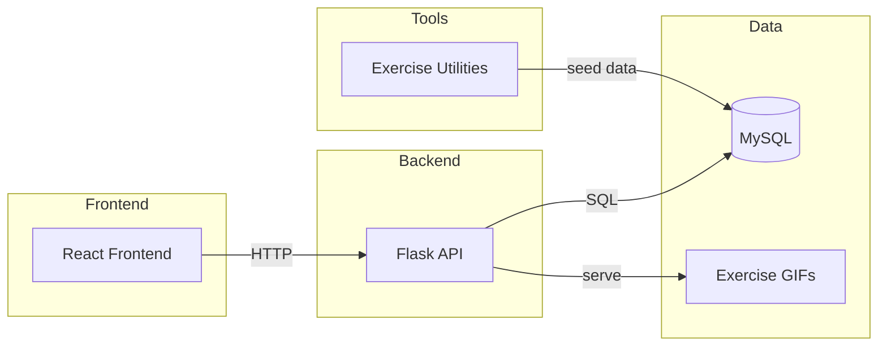

# EmWell Wellness Platform

EmWell is a wellness companion that blends daily reflections, emotion-aware insights, and personalized fitness tracking into a calm, guided experience. This repository includes the React web app, a Flask API, and Python utilities for exercise data and reinforcement-learning recommendations.

Scope note: This README covers the workspace except the Panvel directory, as requested.

## Project Structure

```
.
├─ stitch-health-analytics/                 # React frontend (EmWell UI)
│  ├─ src/                                  # Components, charts, pages
│  ├─ public/                               # Static assets
│  └─ server/                               # Backend services + SQL schema
│     ├─ emotion_backend/                   # Flask API (reflections, workouts, gifs)
│     └─ sql/                               # Database schema
├─ Exercise recomendation project/          # Python utilities for exercise data + RL
│  ├─ exercise_gifs/                        # Local GIF assets
│  └─ sql files/                            # Exercise DB schema and seeds
└─ README.md                                # This file
```

## Architecture (Interactive)



## Key Features

- Daily reflections with mood and sleep tracking
- Mood and sleep trend visualizations
- Fitness sanctuary with workout plans and GIFs
- Calorie-burn bar chart from user history
- Q-learning based exercise recommendation utilities

## Tech Stack

- Frontend: React, Recharts, Tailwind
- Backend: Flask (Python), MySQL, PyMySQL
- Data tools: Python scripts for ingestion and RL recommendations

## How To Use

### 1) Database

Run the schemas:

- [stitch-health-analytics/server/sql/schema.sql](stitch-health-analytics/server/sql/schema.sql)
- [Exercise recomendation project/sql files/](Exercise%20recomendation%20project/sql%20files/)

### 2) Backend (Flask)

From [stitch-health-analytics/server/emotion_backend/](stitch-health-analytics/server/emotion_backend/):

```bash
python -m venv .venv
source .venv/Scripts/activate
pip install -r requirements.txt
python app.py
```

Default port: 5001 (set with `EMOTION_PORT` in [stitch-health-analytics/server/.env](stitch-health-analytics/server/.env)).

### 3) Frontend (React)

From [stitch-health-analytics/](stitch-health-analytics/):

```bash
npm install
npm start
```

Default port: 3000.

### 4) Exercise Data Utilities (Optional)

From [Exercise recomendation project/](Exercise%20recomendation%20project/):

- [exercise_list.py](Exercise%20recomendation%20project/exercise_list.py) to fetch exercises and GIFs
- [exercise_recommend.py](Exercise%20recomendation%20project/exercise_recommend.py) and
  [generalize_exercise.py](Exercise%20recomendation%20project/generalize_exercise.py) for RL workflows

## Environment

Create [stitch-health-analytics/server/.env](stitch-health-analytics/server/.env) with:

- MYSQL_HOST
- MYSQL_USER
- MYSQL_PASSWORD
- MYSQL_DATABASE
- EMOTION_PORT (default 5001)
- JWT_SECRET

Frontend calls the Flask API on `http://localhost:5001`. If you change the API port, update the frontend references.

## API Snapshot

- `GET /api/reflections/<user_id>`
- `POST /api/reflections/submit`
- `GET /api/workouts/active-minutes?userId=<id>&range=<day|week|month>`
- `GET /api/workouts/calories?userId=<id>&range=week`
- `GET /api/exercises?target=<muscle>&difficulty=<level>`
- `GET /api/exercise_gifs/<filename>`

## Notes

- GIF assets are served from [Exercise recomendation project/exercise_gifs/](Exercise%20recomendation%20project/exercise_gifs/).
- The `user_history.calories_burned` column powers the sanctuary calorie bar chart.

## Scripts

Frontend:

```bash
npm start
npm run build
```

Flask API:

```bash
python app.py
```

## License

Specify your license here.
