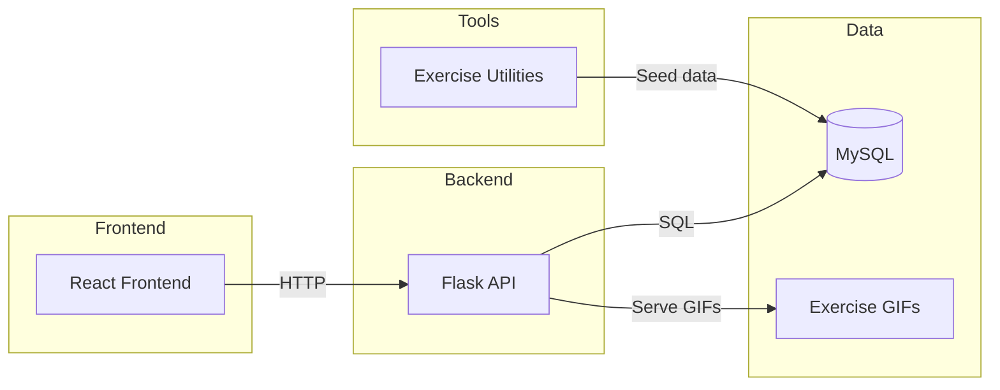

# EmWell - Wellness Intelligence Platform

> A calm, data-informed wellness companion that combines daily reflections, emotional insights, and personalized fitness tracking.

[](https://react.dev)
[](https://flask.palletsprojects.com/)
[](https://www.mysql.com/)
[](LICENSE)

Scope note: This README covers the workspace except the Panvel directory, as requested.

## Project Overview

EmWell provides a gentle, guided wellness experience with mood tracking, sleep insights, and fitness planning. It uses a React frontend for the user experience, a Flask backend for reflections and workout data, and Python utilities for exercise data ingestion and reinforcement-learning recommendations.

### Highlights

- Daily reflections with mood and sleep tracking
- Mood and sleep trend visualizations
- Fitness sanctuary with workout plans and GIFs
- Calorie-burn bar chart from user history
- Q-learning based exercise recommendation utilities

## Project Structure

```
.
├─ stitch-health-analytics/                 # React frontend (EmWell UI)
│  ├─ src/                                  # Components, charts, pages
│  ├─ public/                               # Static assets
│  └─ server/                               # Backend services + SQL schema
│     ├─ emotion_backend/                   # Flask API (reflections, workouts, gifs)
│     └─ sql/                               # Database schema
├─ Exercise recomendation project/          # Python utilities for exercise data + RL
│  ├─ exercise_gifs/                        # Local GIF assets
│  └─ sql files/                            # Exercise DB schema and seeds
└─ README.md                                # This file
```

## System Architecture (Interactive)



## Data Flow

1) User submits daily reflection or workout activity
2) Flask API validates and stores data in MySQL
3) Frontend fetches metrics to render charts
4) Exercise utilities seed and enrich the exercise library

## Tech Stack

### Frontend
- React, Recharts, Tailwind

### Backend
- Flask (Python), MySQL, PyMySQL

### Data Tools
- Python scripts for ingestion and RL recommendations

## How To Use

### 1) Database

Run the schemas:

- [stitch-health-analytics/server/sql/schema.sql](stitch-health-analytics/server/sql/schema.sql)
- [Exercise recomendation project/sql files/](Exercise%20recomendation%20project/sql%20files/)

### 2) Backend (Flask)

From [stitch-health-analytics/server/emotion_backend/](stitch-health-analytics/server/emotion_backend/):

```bash
python -m venv .venv
source .venv/Scripts/activate
pip install -r requirements.txt
python app.py
```

Default port: 5001 (set with `EMOTION_PORT` in [stitch-health-analytics/server/.env](stitch-health-analytics/server/.env)).

### 3) Frontend (React)

From [stitch-health-analytics/](stitch-health-analytics/):

```bash
npm install
npm start
```

Default port: 3000.

### 4) Exercise Data Utilities (Optional)

From [Exercise recomendation project/](Exercise%20recomendation%20project/):

- [exercise_list.py](Exercise%20recomendation%20project/exercise_list.py) to fetch exercises and GIFs
- [exercise_recommend.py](Exercise%20recomendation%20project/exercise_recommend.py) and
  [generalize_exercise.py](Exercise%20recomendation%20project/generalize_exercise.py) for RL workflows

## Environment

Create [stitch-health-analytics/server/.env](stitch-health-analytics/server/.env) with:

- MYSQL_HOST
- MYSQL_USER
- MYSQL_PASSWORD
- MYSQL_DATABASE
- EMOTION_PORT (default 5001)
- JWT_SECRET

Frontend calls the Flask API on `http://localhost:5001`. If you change the API port, update the frontend references.

## API Snapshot

- `GET /api/reflections/<user_id>`
- `POST /api/reflections/submit`
- `GET /api/workouts/active-minutes?userId=<id>&range=<day|week|month>`
- `GET /api/workouts/calories?userId=<id>&range=week`
- `GET /api/exercises?target=<muscle>&difficulty=<level>`
- `GET /api/exercise_gifs/<filename>`

## Notes

- GIF assets are served from [Exercise recomendation project/exercise_gifs/](Exercise%20recomendation%20project/exercise_gifs/).
- The `user_history.calories_burned` column powers the sanctuary calorie bar chart.

## Scripts

Frontend:

```bash
npm start
npm run build
```

Flask API:

```bash
python app.py
```

## License

Specify your license here.

## Acknowledgments

- Recharts for charts and data visualization
- Flask ecosystem for fast API development
- ExerciseDB data sources used by the ingestion utilities
